<!-- ========================= HEADER ========================= -->

  
  

<!-- ========================= ABOUT ========================= -->
## 💫 About Me

🔧 &nbsp;**DevOps Engineer** at [**Polygon**](https://github.com/0xPolygon) — building and operating reliable infrastructure for the blockchain ecosystem 
☸️ &nbsp;I work across **Kubernetes, Terraform, CI/CD, and observability** to keep distributed systems healthy and scalable 
⛓️ &nbsp;Deep interest in **blockchain infrastructure**, node operations, and the tooling that powers Web3 
🌱 &nbsp;Currently sharpening my skills in **Go, platform engineering, and SRE practices** 
👯 &nbsp;Open to collaborating on **DevOps tooling, blockchain infra, and open-source automation** 
💬 &nbsp;Ask me about **Kubernetes, IaC, CI/CD pipelines, observability, and Polygon** 
📫 &nbsp;Reach me: [**Email**](mailto:sanketsaagar1234@gmail.com) • [**Linktree**](https://linktr.ee/sanketsaagar) 
😄 &nbsp;Pronouns: He/Him

<!-- ========================= SOCIALS ========================= -->
## 🌐 Connect With Me

<!-- ========================= TECH STACK ========================= -->
## 🛠️ Tech Stack

**☁️ Cloud & Platforms**

**☸️ Containers, Orchestration & IaC**

**🔄 CI/CD & Observability**

**💻 Languages**

**🗄️ Databases & Backend**

**⛓️ Blockchain & Web3**

**🧰 Tools**

<!-- ========================= METRICS (self-generated, reliable) ========================= -->
## 📊 GitHub Metrics

<!-- This SVG is generated by the "Generate Metrics" GitHub Action and committed to the repo,
     so it always renders (no third-party rate-limit failures). -->

<!-- ========================= STREAK ========================= -->
## 🔥 Contribution Streak

<!-- ========================= ACTIVITY GRAPH ========================= -->
## 📈 Contribution Graph

<!-- ========================= SNAKE ========================= -->
## 🐍 Contribution Snake

<!-- ========================= QUOTE ========================= -->
### ✍️ Dev Quote of the Day

---

  <i>⚡ "Automate everything, observe everything, ship with confidence." ⚡</i>

